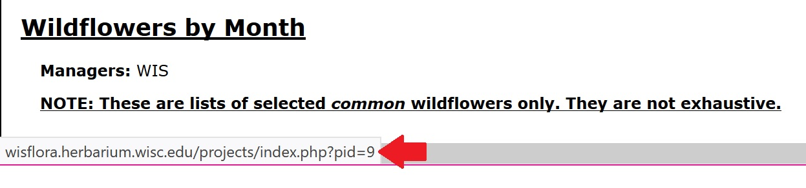

# How to add checklists and floristic projects to menu in WIS Flora

1. Open [http://wisflora.herbarium.wisc.edu/projects/](http://wisflora.herbarium.wisc.edu/projects/) to see the list of existing projects
2. Locate the file `header.php` located in path `\\symbiota.math.wisc.edu`. This file determines everything that will appear in the header portion of the website, including the navigation menu.
3. Make a copy of this file, so you have a backup in case anything goes wrong. Leave it in that same path and rename it, adding a date to it, so you can track the versions.
4. Open the `header.php` file in a text editor (or even notepad.exe).
5. Locate the `Checklists` or the `Projects` menu that you wish to change. I have indicated them by adding this comment before each one:

		<!-- Checklists menu and submenu -->
		<!-- Floristic Projects menu and submenu -->

Each menu is delimited by the tags `<li>` and `</li>`, and each submenu is delimited by the tags `<ul>` and `</ul>`.

6. Find the last item added in the submenu (again delimited by the tags `<li>` and `</li>`). For instance, this is the last link currently in the submenu:

		<li>
			<a href="<?php echo $clientRoot; ?>/projects/index.php?proj=19" >Navarino Cedar Swamp State Natural Area</a>
		</li>	

7. Copy that entire block of code and paste it below it to create a new item. Repeat for as many items as you wish to add in the menu.
8. Replace the name of the project that is found between the `<a>` and `</a>` tags.
9. Replace the number of the project in the PHP code (the digits that appear after the `proj=` code). To find out what is the project number, go back to the [list of existing projects](http://wisflora.herbarium.wisc.edu/projects/) and hover the mouse in the desired project's link. Below, in the browser window, a link will appear, and the number can be found after the `pid=` code like so:

In that case, our code would be:

		<li>
			<a href="<?php echo $clientRoot; ?>/projects/index.php?proj=9" >Wildflowers by Month</a>
		</li>

10. Save your file and reload the website to check if the changes were made. If they appear not to be working, try clearing your browser's cache and reloading the website again.

TA-DA! You're done!
